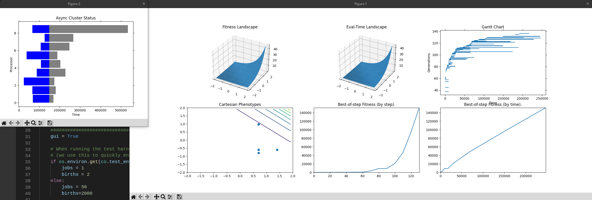
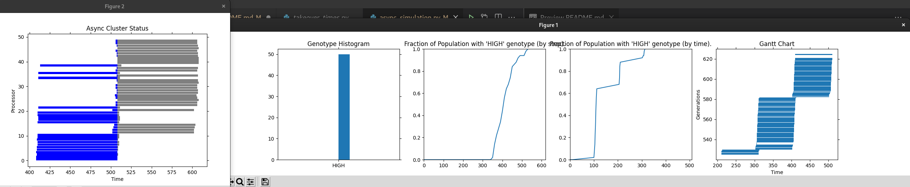

# Avoiding Excess Computation in Asynchronous Evolutionary Algorithms

This repo contains code for part of the experiments described in our 2021 paper,

 - Eric O. Scott, Mark Coletti, Catherine D. Schuman, Bill Kay, Shruti R. Kulkarni, and Maryma Parsa.  "Avoiding Excess Computation in Asynchronous Evolutionary Algorithms," 20th UK Workshop on Computational Intelligence.

The project consists of a Python module, `async_sim.components`, which provides objects that are composed
into experiment applications found under `examples`.

Our algorithms are built atop v0.7dev of the [LEAP library](https://leap-gmu.readthedocs.io/) (see `leap_ec` [on PyPI](https://pypi.org/project/leap-ec/)).

The scripts here will generate live telemetry plots (these differ from the plots in the paper, which were computed offline from the outputted CSV data):






## Setup

Optionally set up a virtual environment (ex. via `python -m venv ./venv && source venv/bin/activate`).

Then install the package:

```bash
pip install -e .
```

Ensure the tests pass:

```bash
pip install pytest
pytest
```

## Run Experiments

```bash
python examples/async_simulation.py
python examples/takeover_times.py
```
